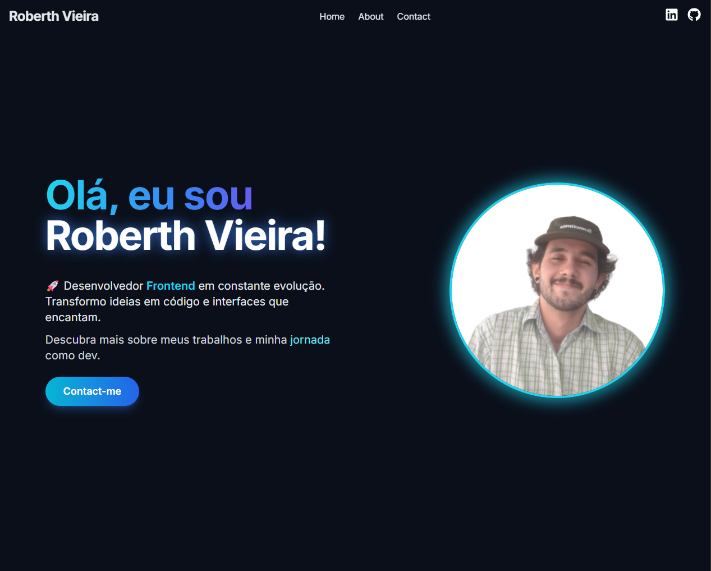

# 🌐 Meu Portfólio — Roberth Vieira

Bem-vindo ao meu portfólio pessoal!
Aqui você encontra meus principais projetos, minha trajetória como desenvolvedor, minhas habilidades e canais de contato.

Este projeto foi desenvolvido com foco em **performance, design responsivo, navegação suave e componentização moderna**, utilizando React, TypeScript e TailwindCSS.


---

## 🔗 **Deploy**
Acesse o site completo aqui: 
👉 **https://roberthvieiradev.vercel.app/**

---

## 🖼️ **Preview**


---


## ✨ **Funcionalidades**

- **Página Home** — Apresentação, chamada para contato e destaque do desenvolvedor.
- **Seção de Projetos** — Lista de projetos com imagem, descrição, deploy e GitHub.  
- **Sobre Mim** — Minha jornada, formação, hard skills e soft skills.
- **Contato** — Seção com formulário e informações sociais.
- **Design totalmente responsivo** — Desktop, tablet e mobile.
- **UI moderna** com animações suaves.
- **Tema escuro** com visual minimalista.

---


## 🚀 **Tecnologias Utilizadas**

### **Frontend**
- React.js
- TypeScript 
- React Router DOM
- TailwindCSS
- Vite

### **Outras técnicas**
- Hooks personalizados (ex: `useScrollAnimation`)  
- Componentização avançada  
- Navegação com ScrollToTop  
- Importação otimizada de imagens  
- UX/UI aprimorada

---


## 📦 **Como executar o projeto**

### **1. Clone o repositório**
```bash
git clone https://github.com/RoberthVieira/MyPortfolio

2 - Acesse o diretório
cd MyPortfolio

3 - Instale as dependências
npm install

4 - Rode o projeto
npm run dev

O servidor iniciará em: http://localhost:5173/

```

---


## **🗂️ Estrutura do projeto**
```
src/
├── assets/
│   └── ... (imagens e arquivos estáticos)
│
├── components/
│   ├── Header.tsx
│   ├── NavBar.tsx
│   ├── Footer.tsx
│   ├── Projects.tsx
│   ├── ProjectCard.tsx
│   ├── Contact.tsx
│   ├── Button.tsx
│   └── AboutSection.tsx
│
├── data/
│   └── ProjectData.ts
│
├── hooks/
│   └── useScrollAnimation.ts
│
├── pages/
│   ├── Home.tsx
│   └── About.tsx
│
├── styles/
│   ├── index.css
│   └── App.css
│
├── types/
│   └── index.ts
│
├── utils/
│   └── ScrollToTop.tsx
│
├── App.tsx
└── main.tsx
```
---


## **🧑‍💻 Sobre o Desenvolvedor**

Sou Roberth Vieira, desenvolvedor Frontend em constante evolução e estudando para me tornar Fullstack.
Atualmente desenvolvo com:
- React
- TypeScript
- Tailwind
- Node.js
- JavaScript ES6+

E busco sempre criar interfaces modernas, intuitivas e bem estruturadas.

---


## **📬 Contato**

Se quiser conversar, colaborar ou conhecer mais do meu trabalho:
- LinkedIn: https://www.linkedin.com/in/roberth-vieira-501490211/
- GitHub: https://github.com/RoberthVieira
- Email: roberthvieiracv@gmail.com

---


## **📄 Licença**

Este projeto é livre para estudo.
Não é permitido replicar como portfólio próprio.

---


⭐ Se este repositório te ajudou, considere deixar uma estrela!
